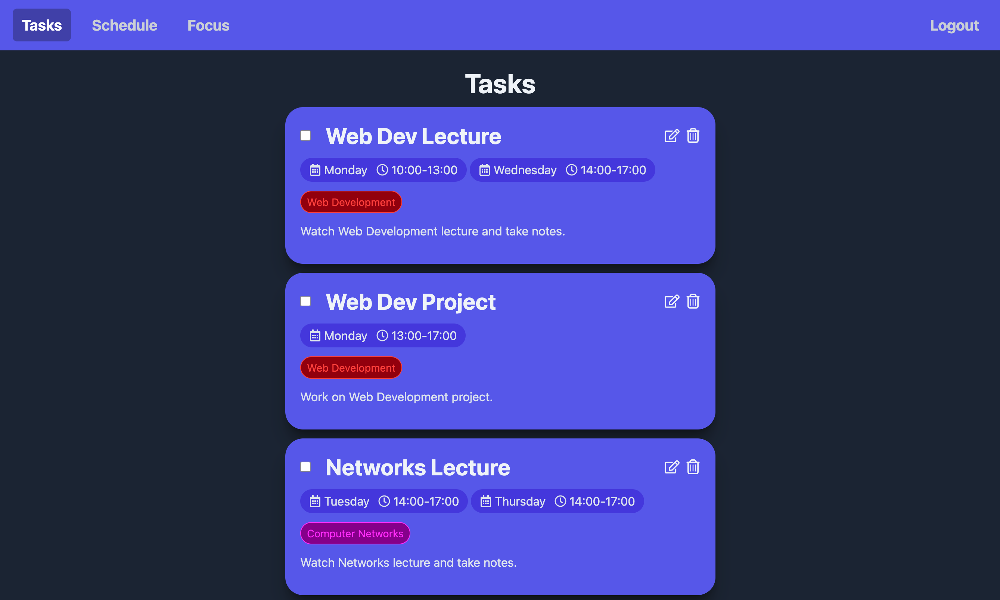
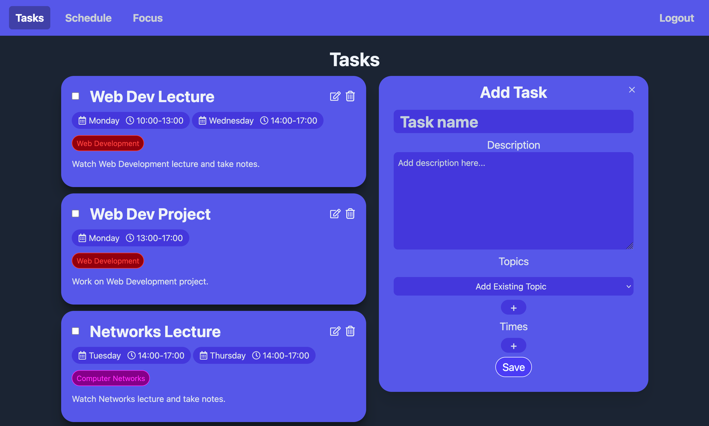
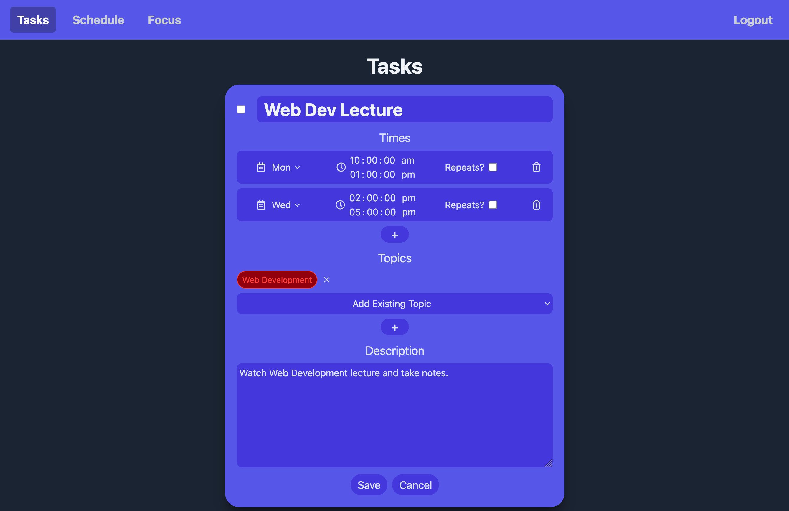
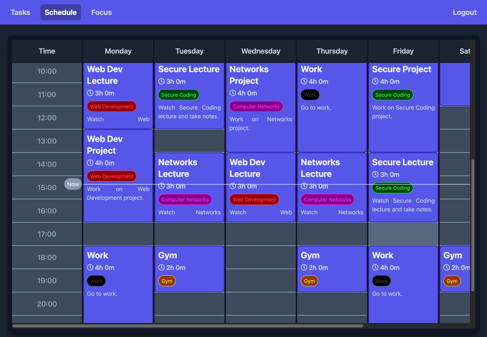
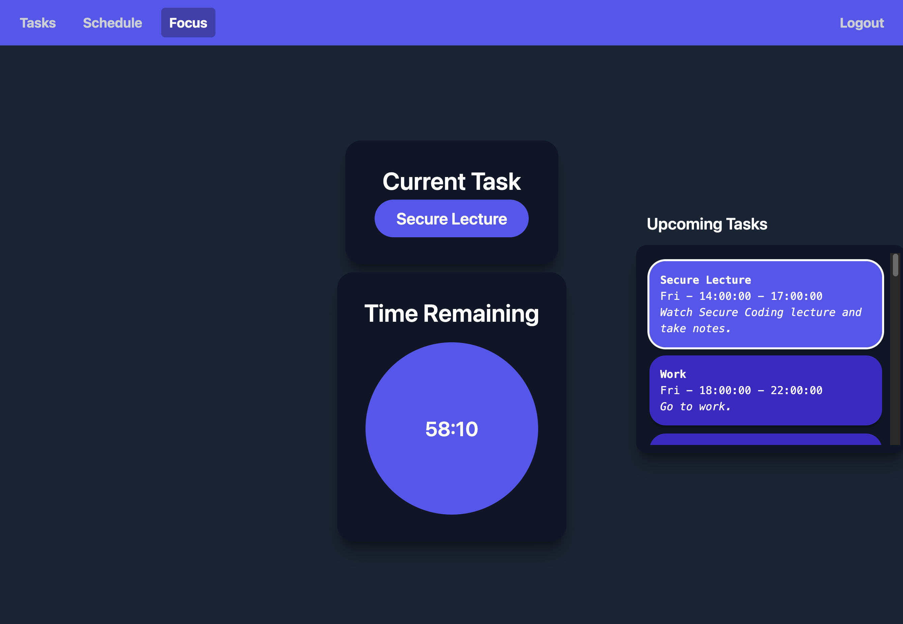

# LonkedIn : Not a Calendar

## Overview

LonkedIn is a streamlined task and time management system designed for students, employees, and anyone who likes to organise their time.

## Tasks

Users can **create and manage** their tasks in a **to-do list fashion** on the **Tasks page**. Each task can be assigned a name and description, as well as a number of topics and times. 

**Topics** denote what the task relates to and provides visual organiation between related tasks. **Times** denote a timeframe for working on this task throughout the week.

Users can add new tasks using the **Add Task** form.

Users can also edit existing tasks by clicking the edit button in the top right of the task.

## Schedule

Users can view their schedule on the **Schedule Page**, showing visually which tasks have been assinged to which times during the week.

Hovering over a task in the timetable will display more information about it.

## Focus

Finally, users can view the task scheduled for the current time, the time remaining on this task, as well as upcoming tasks. If there is no task scheduled for the current time the page will instead display the next upcoming task and a timer until it begins.

